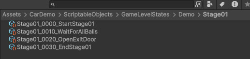

# Unity Car Demo

*** This is not a real game project. ***

*** This project is created for job interview only ***


# Usage
Unity Editor Version Required:
```bash
Unity 6 (6000.0.44f1)
```

Starting Scene:
```bash
Assets/CarDemo/Scenes/MenuScene
```

Control Methods:

Keyboard
- W - Forward
- A - Left
- S - Reverse / Brake
- D - Right
- Space - Drift

Touch
- Virtual game pad

  

# Code Structure


A `GameDirector` is created for accessing all major features in the game framework:
- `GameInputManager` (abstraction for inputs like keyboard and touch screen)
- `CameraManager` (camera movement control)
- `ObjectTagManager` (object tagging system for accessing objects quickly)
- `GameEventManager` (game event mechanism)
- `GameConditionManager` (system to save game conditions)
- `StateMachineManager` (state machine system for controlling game flow)
- `GameLoadingManager` (scene loading management)

Game Director:


```csharp
GameDirector.Instance.GameInputManager.GetForward();
```

```csharp
GameDirector.Instance.GameLoadingManager.LoadingSceneAsync(_gameLoadingSceneSO);
```

Object Tag:


```csharp
if (_callMultipleObjects)
{
    List<ObjectTag> objectTags = GameDirector.Instance.ObjectTagManager.GetObjectsByTag(_objectTag);

    foreach (ObjectTag tag in objectTags)
    {
        CallObjectTag(tag);
    }
}
else
{
    ObjectTag tag = GameDirector.Instance.ObjectTagManager.GetObjectByTag(_objectTag);

    if (tag)
    {
        CallObjectTag(tag);
    }
}
```

Game Event:


Game Condition:


```csharp
GameDirector.Instance.GameConditionManager.OnConditionRegistered += GameConditionManager_OnConditionRegistered;

private void GameConditionManager_OnConditionRegistered(GameConditionSO gameConditionSO)
{
    if (gameConditionSO == _targetGameCondition)
    {
        // do something...
    }
}

public bool CheckCondition()
{
    return GameDirector.Instance.GameConditionManager.CheckGameCondition(_targetGameCondition);
}
```

State Machine:




Game Loading:


```csharp
using UnityEngine;

namespace CarDemo
{
    [CreateAssetMenu(fileName = "StateMachineStateSO_LoadScene", menuName = "Car Demo/SO/Game State/Load Scene")]
    public class StateMachineStateSO_LoadScene : StateMachineStateSO
    {
        [SerializeField]
        private GameLoadingSceneSO _gameLoadingSceneSO;

        public override void StateStart(StateMachine stateMachine)
        {
            base.StateStart(stateMachine);

            if (_gameLoadingSceneSO)
            {
                GameDirector.Instance.GameLoadingManager.LoadingSceneAsync(_gameLoadingSceneSO);
            }

            EndCurrentState();
        }

        public override void StateTick()
        {
            base.StateTick();
        }

        public override void StateEnd()
        {
            base.StateEnd();
        }
    }
}
```
